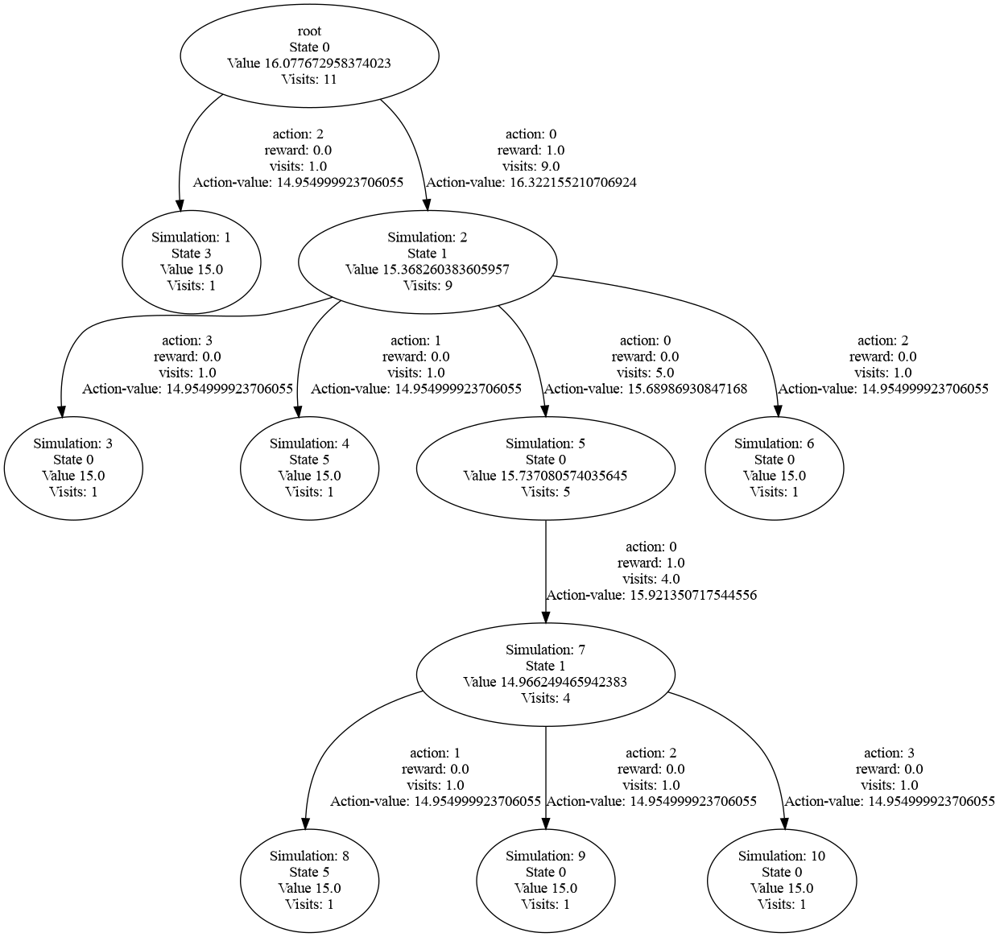
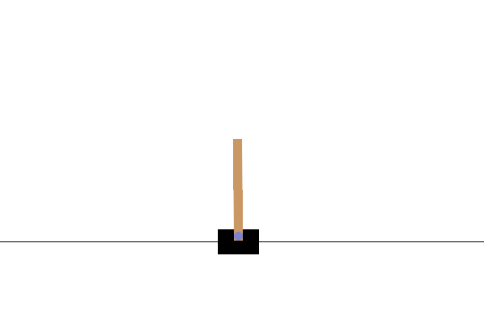
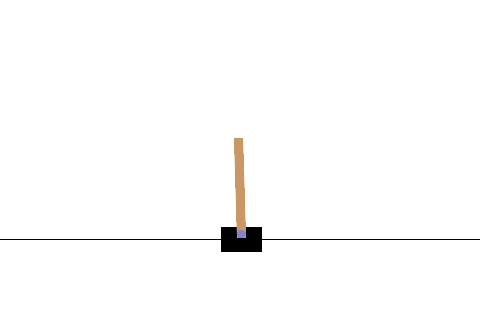

# Step-by-step Reimplementation Attempt of MuZero for Ms Pacman

> Work in progress. Feedback welcome.
> I gave a brief (5 min) interactive presentation about this implementation at an AI meetup in Zurich. The slide I used to motivate the backgroud is [here](presentation.pdf).

## Contents

1. [Dyna-Q](#dyna-q-notebook)
2. [Deep-Q-Network (DQN)](#dqn-notebook)
3. [Monte-Carlo Tree Search (MCTS)](#mcts-notebook)
4. [MuZero](#muzero)
5. [References](#references)

## Dyna-Q [Notebook](notebooks/dyna-q.ipynb) 

Dyna-Q is a Q-learning algorithm with a planning component that iterates additional Q-learning steps based on previously encountered state-action-reward-next state transitions. We implement Tabular Dyna-Q from Chapter 8 of Sutton & Barto (Example 8.1) with a gridworld environment.

## DQN [Notebook](notebooks/DQN.ipynb)

DQN trains a network to predict Q-values based on previously seen transitions sampled from a replay buffer in a supervised fashion.

| Environment | Random policy | Signs-of-life policy | Training details |
| ----------- | ------------- | -------------------- | ---------------- |
| Pong |  | Random action during evaluation with 0% vs 5% probability. Scores: 5:21 vs 8:21   | 10 mio frames | 

## MCTS [Notebook](notebooks/MCTS-reproduction-of-MCTX-visualization-demo.ipynb)

Monte-Carlo tree search is a search algorithm that selects at each step the most promising action, in terms of how good actions are expected to be vs. how much uncertainty there is. New actions are initialized by accessing either the environment or a model thereof, while existing Q-value estimates are used within the tree. We implement a naive Python version of the MCTS algorithm used by MuZero, and compare its output with the faster JAX implementation released by DeepMind, [MCTX](https://github.com/google-deepmind/mctx).

The result of such a tree search can be visualized like the graph below. The search starts at the top-most node. For each simulation, the existing tree is traversed until either a new action from a non-leaf node is selected, or until a leaf node is reached. In both cases, a new node is appended by accessing the model to give a prediction of the achieved reward for the transition and the value of the new node. In the example below, in the first simulation, action 2 was chosen first, reward 0.0 received, and state 3 reached. This node is never revisited, as all following simulations choose action 0 at the root node. The last simulation 10 chooses actions 0, 0, 0, 3, to end up in the node at the bottom right. 

After each simulation, Q-values and values are updated iteratively along the simulation path, backwards starting at the newly added node.

An action is chosen randomly according to the visit count at the root node.

Currently there are two versions of the own implementation of MCTS:  which is trying to reproduce MCTX, including the pseudorandomness behaviour (currently fails after 10 simulations), and  which does not try to match the seeds of MCTX, but does not have a dependency on JAX.

I recommend using MCTX as it is much faster than my implementation.

## MuZero [Notebook](notebooks/MuZero_CartPole.ipynb) (for CartPole...)

This is an attempted minimal from-scratch implementation of MuZero, without having looked at reference implementations or the published pseudocode. It gives signs of life on CartPole:

| Environment | Random policy | Signs-of-life policy | Training details |
| ----------- | ------------- | -------------------- | ---------------- |
| CartPole-v1 |  |  | 341 reward | 

A typical traning run currently looks like this:

Some features from the paper that currently are / are not implemented:

- Very simple neural network structure for representation, prediction and dynamics function
- Uniform sampling from the replay buffer, no prioritized replay and no importance sampling correction
- Value targets and rewards are are scaled down according to the transformation h (page 14 of the [MuZero paper](https://arxiv.org/abs/1911.08265)
- Value targets and rewards are discretized and given as weighted average over an integer range, with CrossEntropy loss function
- n as in n-step bootstrap and K as in number of rollouts are variable, but the gradients are not appropriately scaled
- Run time is a concern... it takes about 1 hour on CPU to get signs of life, with minimal settings (e.g., replay buffer size in the run above was 200, which is shorter than one episode of a trained policy (time limit of 500), but is enough to have lots of terminations from an untrained policy)
- Truncations are not correctly treated (this may not currently be relevant if the replay buffer is so small, as it will not contain any truncated episodes)
- Use of the number of allowed actions of the environment, no special treatment of allowed actions vs a potentially larger full action set
- Terminal states are treated as absorbing states by my own interpretation: rewards are set to 0, as is the value function. The policy target for such states is currently set to the uniform policy (probability of 1/number of actions for each action), and the selected action used in the rollout beyond terminal states is a uniformly random sampled action.
- MCTS produces an improved value estimate at the root function which is used as in the value targets. How this improved value exactly is derived is not described in the paper. I aligned to the MCTX implementation. It works similar to the backup of the Q-values in the search tree, described on page 12 of the MuZero paper.
- No scaling of the hidden state to [0, 1].
- No temperature and no Dirichlet exploration noise in the sampling from the MCTS root node.
- Currently only runs on CPU, specifically with MCTS being single-threaded (slow..)

## References

### Main

[Reinforcement Learning: An Introduction (Sutton & Barto)](http://incompleteideas.net/book/the-book-2nd.html)

[Playing Atari with Deep Reinforcement Learning (DQN Arxiv 2013)](https://arxiv.org/abs/1312.5602)

[Human-level control through deep reinforcement learning (DQN Nature 2015)](https://www.nature.com/articles/nature14236)

[Mastering the game of Go with deep neural networks and tree search (AlphaGo)](https://storage.googleapis.com/deepmind-media/alphago/AlphaGoNaturePaper.pdf)

[Mastering the Game of Go without Human Knowledge (AlphaGo Zero)](https://discovery.ucl.ac.uk/id/eprint/10045895/1/agz_unformatted_nature.pdf)

[Mastering Chess and Shogi by Self-Play with a General Reinforcement Learning Algorithm (AlphaZero)](https://arxiv.org/pdf/1712.01815)

[Mastering Atari, Go, Chess and Shogi by Planning with a Learned Model (MuZero)](https://arxiv.org/abs/1911.08265)

[MuZero Pseudocode](https://arxiv.org/src/1911.08265v2/anc/pseudocode.py)

[Monte Carlo tree search in JAX (MCTX)](https://github.com/google-deepmind/mctx)

### Related

[Deep Reinforcement Learning and the Deadly Triad](https://arxiv.org/pdf/1812.02648) (function approximation, off-policy learning, and bootstrapping)

## TODO

- [x] Dyna-Q
- [x] DQN 
  - [x] Replay buffer
  - [x] Atari environment
  - [x] Neural network, stochastic gradient descent
  - [x] Training loop
  - [x] Signs of life :)
  - [ ] GPU
  - [x] Debug!
  - [ ] Remaining details from both DQN papers
  - [x] Run for the full number of frames
- [ ] MuZero
  - [x] Monte-Carlo tree search
    - [x] Does it work with tensors
    - [ ] ... batches
  - [ ] Other changes to DQN
    - [x] Different loss
    - [x] TD-targets
    - [ ] Non-uniform sampling from replay buffer
    - [ ] ...
