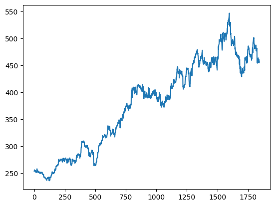

# Reimplementation attempt of MuZero for Ms Pacman

1. Dyna-Q
2. DQN
3. MCTS
4. MuZero

> Work in progress. Feedback welcome.

Supervised learning on a replay buffer with value targets generated by self-play and Monte-Carlo tree search?

Signs of life of DQN on Ms Pacman after 1mio frames:

TODO

- [x] Dyna-Q [Notebook](notebooks/dyna-q.ipynb)
- [ ] DQN [Notebook Work in Progress](notebooks/DQN.ipynb)
  - [x] Replay buffer
  - [x] Atari environment
  - [x] Neural network, stochastic gradient descent
  - [x] Training loop
  - [x] Signs of life :)
  - [ ] GPU
  - [ ] Debug!
  - [ ] Remaining details from both DQN papers
  - [ ] Run for the full number of frames
- [ ] MuZero
  - [x] Monte-Carlo tree search [Notebook](notebooks/MCTS-reproduction-of-MCTX-visualization-demo.ipynb)
    - [ ] Does it work with tensors / batches
  - [ ] Other changes to DQN
    - [ ] Different loss
    - [ ] TD-targets
    - [ ] Non-uniform sampling from replay buffer
    - [ ] ...
